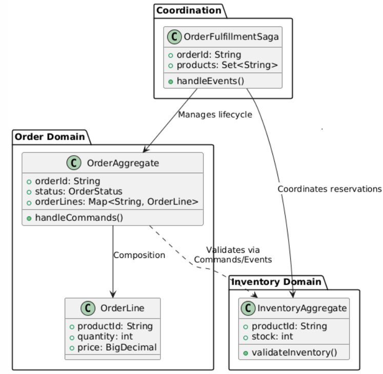
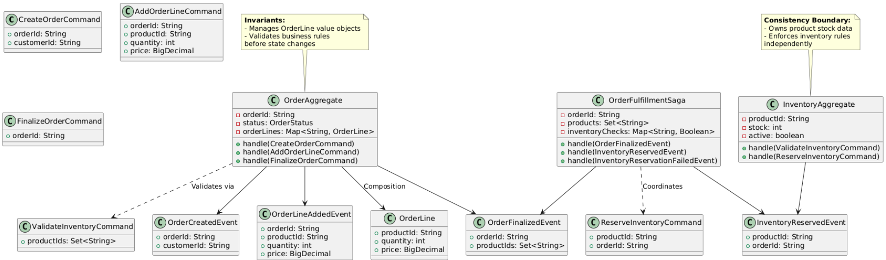
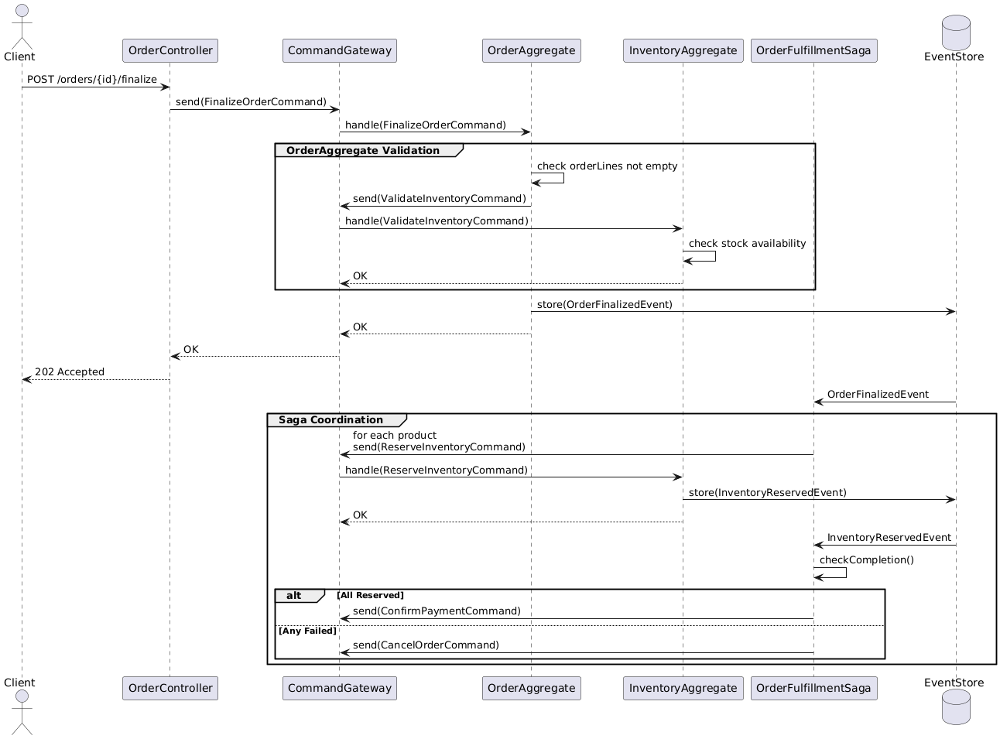
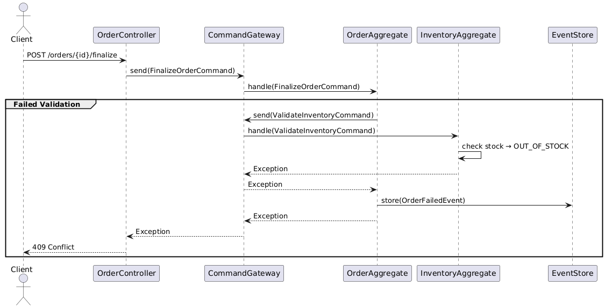

# Multi-aggregate relationships in Axon

- [Axon Platform](README.md)

## 1. Aggregate Design (Master-Detail)

```java
// Master Aggregate - Order
@Aggregate
public class OrderAggregate {
    @AggregateIdentifier
    private String orderId;
    private OrderStatus status;
    private String customerId;
    private Map<String, OrderLine> orderLines = new HashMap<>();

    @CommandHandler
    public OrderAggregate(CreateOrderCommand cmd) {
        if (cmd.getCustomerId() == null) {
            throw new IllegalArgumentException("Customer ID required");
        }
        apply(new OrderCreatedEvent(cmd.getOrderId(), cmd.getCustomerId()));
    }

    @CommandHandler
    public void handle(AddOrderLineCommand cmd) {
        if (status != OrderStatus.DRAFT) {
            throw new IllegalStateException("Cannot modify finalized order");
        }

        if (orderLines.containsKey(cmd.getProductId())) {
            throw new BusinessException("Product already exists in order");
        }

        apply(new OrderLineAddedEvent(
            orderId,
            cmd.getProductId(),
            cmd.getQuantity(),
            cmd.getPrice()
        ));
    }

    @CommandHandler
    public void handle(FinalizeOrderCommand cmd) {
        if (orderLines.isEmpty()) {
            throw new BusinessException("Order must have at least one line");
        }

        // Cross-aggregate validation example
        commandGateway.send(new ValidateInventoryCommand(orderLines.keySet()))
            .exceptionally(ex -> {
                throw new BusinessException("Inventory validation failed: " + ex.getMessage());
            });

        apply(new OrderFinalizedEvent(orderId));
    }

    @EventSourcingHandler
    public void on(OrderCreatedEvent event) {
        this.orderId = event.getOrderId();
        this.customerId = event.getCustomerId();
        this.status = OrderStatus.DRAFT;
    }

    @EventSourcingHandler
    public void on(OrderLineAddedEvent event) {
        this.orderLines.put(event.getProductId(),
            new OrderLine(event.getProductId(), event.getQuantity(), event.getPrice()));
    }

    @EventSourcingHandler
    public void on(OrderFinalizedEvent event) {
        this.status = OrderStatus.FINALIZED;
    }
}

// Detail Value Object
public class OrderLine {
    private String productId;
    private int quantity;
    private BigDecimal price;

    // constructor/getters
}
```

## 2. Supporting Aggregate (Inventory)

```java
@Aggregate
public class InventoryAggregate {
    @AggregateIdentifier
    private String productId;
    private int stock;
    private boolean active;

    @CommandHandler
    public void handle(ValidateInventoryCommand cmd) {
        if (!active) {
            throw new BusinessException("Product " + productId + " is discontinued");
        }
        if (stock <= 0) {
            throw new BusinessException("Insufficient stock for " + productId);
        }
    }

    @CommandHandler
    public void handle(UpdateStockCommand cmd) {
        if (cmd.getQuantity() <= 0) {
            throw new IllegalArgumentException("Quantity must be positive");
        }
        apply(new StockUpdatedEvent(productId, cmd.getQuantity()));
    }

    @EventSourcingHandler
    public void on(ProductRegisteredEvent event) {
        this.productId = event.getProductId();
        this.active = true;
    }

    @EventSourcingHandler
    public void on(StockUpdatedEvent event) {
        this.stock += event.getQuantity();
    }
}
```

## 3. Saga for Cross-Aggregate Coordination

```java
@Saga
public class OrderFulfillmentSaga {
    private String orderId;
    private Set<String> products;
    private Map<String, Boolean> inventoryChecks = new HashMap<>();

    @StartSaga
    @SagaEventHandler(associationProperty = "orderId")
    public void handle(OrderFinalizedEvent event) {
        this.orderId = event.getOrderId();
        this.products = event.getProducts(); // Extracted from event

        products.forEach(productId ->
            commandGateway.send(new ReserveInventoryCommand(productId, orderId))
        );
    }

    @SagaEventHandler(associationProperty = "orderId")
    public void handle(InventoryReservedEvent event) {
        inventoryChecks.put(event.getProductId(), true);
        checkCompletion();
    }

    @SagaEventHandler(associationProperty = "orderId")
    public void handle(InventoryReservationFailedEvent event) {
        inventoryChecks.put(event.getProductId(), false);
        commandGateway.send(new CancelOrderCommand(orderId, "Inventory reservation failed"));
        SagaLifecycle.end();
    }

    private void checkCompletion() {
        if (inventoryChecks.size() == products.size() &&
            inventoryChecks.values().stream().allMatch(Boolean.TRUE::equals)) {

            commandGateway.send(new ConfirmPaymentCommand(orderId));
        }
    }

    @EndSaga
    @SagaEventHandler(associationProperty = "orderId")
    public void handle(OrderCancelledEvent event) {
        // Compensating transactions
        products.forEach(productId ->
            commandGateway.send(new ReleaseInventoryCommand(productId))
        );
    }
}
```

## 4. Key Patterns for Multi-Aggregate Operations

1. Eventual Consistency:

```java
// In OrderAggregate
@CommandHandler
public void handle(FinalizeOrderCommand cmd) {
    // Async validation
    CompletableFuture<Boolean> validation = commandGateway.send(
        new ValidateInventoryCommand(orderLines.keySet())
    );

    // Blocking wait (for demo - real apps should use sagas)
    try {
        validation.get(5, TimeUnit.SECONDS);
        apply(new OrderFinalizedEvent(orderId));
    } catch (Exception ex) {
        throw new BusinessException("Validation failed: " + ex.getMessage());
    }
}
```

2. Cross-Aggregate References:

```java
public class OrderFinalizedEvent {
    private String orderId;
    private Set<String> productIds; // References to Inventory aggregates
}
```

3. Concurrency Control:

```java
@CommandHandler
public void handle(UpdateOrderCommand cmd, @MetaData("version") Long version) {
    if (!this.version.equals(version)) {
        throw new ConcurrencyException("Optimistic lock failed");
    }
    // ...
}
```

## 5. Transaction Management Configuration

```yml
# application.yml
axon:
  eventhandling:
    processors:
      default:
        mode: tracking
        threadCount: 2
  saga:
    repository: jpa
  jpa:
    use-serialized-entities: true
```

## 6. UML Diagram (Simplified)



```java

```

## Key Considerations:

1. Aggregate Boundaries:

- Order owns its lines (value objects)
- Inventory is separate aggregate root
- No direct DB joins - reference by ID

2. Consistency Patterns:

- Strong Consistency: Within single aggregate
- Eventual Consistency: Across aggregates via sagas

3. Failure Handling:

```java
// In Saga
@SagaEventHandler
public void handle(InventoryReservationFailedEvent event) {
    commandGateway.send(new CompensateOrderCommand(event.getOrderId()));
    SagaLifecycle.end();
}
```

4. Performance Optimization:

```java
// Projection for read-side
@EventHandler
public void on(OrderLineAddedEvent event, @Timestamp Instant timestamp) {
    orderLineRepository.save(new OrderLineProjection(
        event.getOrderId(),
        event.getProductId(),
        event.getQuantity(),
        timestamp
    ));
}
```

- This implementation shows:
  - Master-detail relationship within an aggregate (Order-Lines)
  - Cross-aggregate validation (Order-Inventory)
  - Saga-based coordination
  - Compensating transactions
  - Concurrency control

## 1. Class Diagram (Master-Detail Aggregates)



## 2. Sequence Diagram (Order Finalization Flow)



**Sequence Diagram:**

1. Happy Path:

   - Order validation → Inventory check → Reservation → Payment

2. Error Handling:

   - Inventory check fails → Cancel order
   - Reservation fails → Compensating transaction

3. Asynchronous Flow:
   - CommandGateway mediates between components
   - EventStore triggers saga events

## 4. Alternative Error Scenario Sequence


