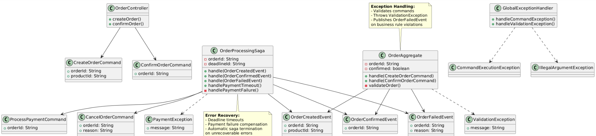
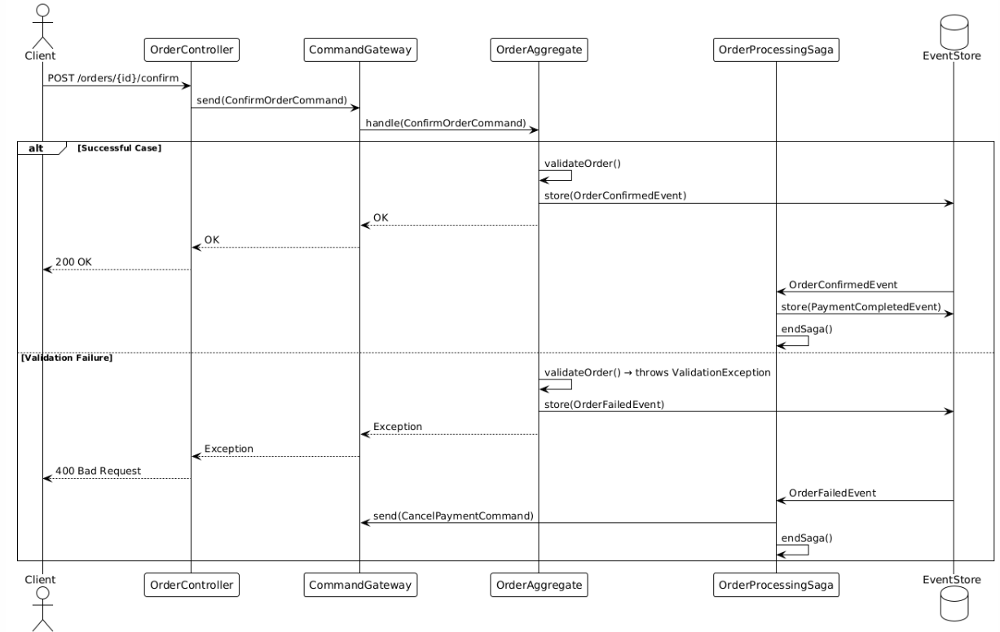

# A complete example of exception handling in Axon Framework with Spring Boot, covering both Aggregates and Sagas:

---

- [Axon Platform](README.md)

## 1. Maven Dependencies (pom.xml)

```xml
<dependencies>
    <dependency>
        <groupId>org.springframework.boot</groupId>
        <artifactId>spring-boot-starter-web</artifactId>
    </dependency>
    <dependency>
        <groupId>org.axonframework</groupId>
        <artifactId>axon-spring-boot-starter</artifactId>
        <version>4.8.0</version>
    </dependency>
</dependencies>
```

## 2. Aggregate with Exception Handling

```java
import org.axonframework.commandhandling.CommandHandler;
import org.axonframework.eventsourcing.EventSourcingHandler;
import org.axonframework.modelling.command.AggregateIdentifier;
import org.axonframework.modelling.command.AggregateLifecycle;
import org.axonframework.spring.stereotype.Aggregate;

@Aggregate
public class OrderAggregate {

    @AggregateIdentifier
    private String orderId;
    private boolean confirmed;

    // Required by Axon
    protected OrderAggregate() {}

    @CommandHandler
    public OrderAggregate(CreateOrderCommand command) {
        if (command.getProductId() == null) {
            throw new IllegalArgumentException("Product ID cannot be null");
        }
        AggregateLifecycle.apply(new OrderCreatedEvent(command.getOrderId(), command.getProductId()));
    }

    @CommandHandler
    public void handle(ConfirmOrderCommand command) {
        if (this.confirmed) {
            throw new IllegalStateException("Order already confirmed");
        }

        try {
            // Business logic that might fail
            validateOrder();
            AggregateLifecycle.apply(new OrderConfirmedEvent(orderId));
        } catch (ValidationException ex) {
            // Handle business exception
            AggregateLifecycle.apply(new OrderFailedEvent(orderId, ex.getMessage()));
            throw ex; // Re-throw for command handler
        }
    }

    private void validateOrder() throws ValidationException {
        // Simulate validation failure
        if (orderId.startsWith("INVALID")) {
            throw new ValidationException("Invalid order prefix");
        }
    }

    @EventSourcingHandler
    public void on(OrderCreatedEvent event) {
        this.orderId = event.getOrderId();
        this.confirmed = false;
    }

    @EventSourcingHandler
    public void on(OrderConfirmedEvent event) {
        this.confirmed = true;
    }
}
```

## 3. Saga with Exception Handling

```java
import org.axonframework.commandhandling.CommandCallback;
import org.axonframework.commandhandling.CommandMessage;
import org.axonframework.commandhandling.gateway.CommandGateway;
import org.axonframework.deadline.DeadlineManager;
import org.axonframework.deadline.annotation.DeadlineHandler;
import org.axonframework.modelling.saga.EndSaga;
import org.axonframework.modelling.saga.SagaEventHandler;
import org.axonframework.modelling.saga.StartSaga;
import org.axonframework.spring.stereotype.Saga;
import org.springframework.beans.factory.annotation.Autowired;

import java.time.Duration;

@Saga
public class OrderProcessingSaga {

    @Autowired
    private transient CommandGateway commandGateway;
    @Autowired
    private transient DeadlineManager deadlineManager;

    private String orderId;
    private String deadlineId;

    @StartSaga
    @SagaEventHandler(associationProperty = "orderId")
    public void handle(OrderCreatedEvent event) {
        this.orderId = event.getOrderId();
        this.deadlineId = deadlineManager.schedule(
            Duration.ofMinutes(30),
            "payment-timeout"
        );

        try {
            commandGateway.send(new ProcessPaymentCommand(orderId),
                new CommandCallback<ProcessPaymentCommand, Object>() {
                    @Override
                    public void onResult(CommandMessage<? extends ProcessPaymentCommand> commandMessage,
                                        CommandResultMessage<?> commandResultMessage) {
                        if (commandResultMessage.isExceptional()) {
                            handlePaymentFailure(commandResultMessage.exceptionResult());
                        }
                    }
                });
        } catch (Exception ex) {
            handlePaymentFailure(ex);
        }
    }

    @SagaEventHandler(associationProperty = "orderId")
    public void handle(OrderConfirmedEvent event) {
        deadlineManager.cancelSchedule(deadlineId);
        // Additional confirmation logic
        SagaLifecycle.end();
    }

    @SagaEventHandler(associationProperty = "orderId")
    @EndSaga
    public void handle(OrderFailedEvent event) {
        deadlineManager.cancelSchedule(deadlineId);
        commandGateway.send(new CancelPaymentCommand(orderId));
    }

    @DeadlineHandler(deadlineName = "payment-timeout")
    public void handlePaymentTimeout() {
        commandGateway.send(new CancelOrderCommand(orderId, "Payment timeout"));
        SagaLifecycle.end();
    }

    private void handlePaymentFailure(Throwable exception) {
        commandGateway.send(new CancelOrderCommand(orderId, "Payment failed: " + exception.getMessage()));
        SagaLifecycle.end();
    }
}
```

## 4. Commands and Events

```java
// Commands
public class CreateOrderCommand {
    @TargetAggregateIdentifier private String orderId;
    private String productId;
    // constructor/getters
}

public class ConfirmOrderCommand {
    @TargetAggregateIdentifier private String orderId;
    // constructor/getters
}

public class ProcessPaymentCommand {
    private String orderId;
    // constructor/getters
}

// Events
public class OrderCreatedEvent {
    private String orderId;
    private String productId;
    // constructor/getters
}

public class OrderConfirmedEvent {
    private String orderId;
    // constructor/getters
}

public class OrderFailedEvent {
    private String orderId;
    private String reason;
    // constructor/getters
}
```

## 5. Custom Exceptions

```java
public class ValidationException extends Exception {
    public ValidationException(String message) {
        super(message);
    }
}

public class PaymentException extends RuntimeException {
    public PaymentException(String message) {
        super(message);
    }
}
```

## 6. Global Exception Handler

```java
import org.axonframework.commandhandling.CommandExecutionException;
import org.axonframework.commandhandling.gateway.CommandGateway;
import org.springframework.web.bind.annotation.ExceptionHandler;
import org.springframework.web.bind.annotation.RestControllerAdvice;

@RestControllerAdvice
public class GlobalExceptionHandler {

    @ExceptionHandler(CommandExecutionException.class)
    public ResponseEntity<String> handleCommandException(CommandExecutionException ex) {
        return ResponseEntity.status(500)
            .body("Command failed: " + ex.getMessage());
    }

    @ExceptionHandler(IllegalArgumentException.class)
    public ResponseEntity<String> handleValidationException(IllegalArgumentException ex) {
        return ResponseEntity.badRequest().body(ex.getMessage());
    }
}
```

### 7. Controller Example

```java
@RestController
@RequestMapping("/orders")
public class OrderController {

    private final CommandGateway commandGateway;

    public OrderController(CommandGateway commandGateway) {
        this.commandGateway = commandGateway;
    }

    @PostMapping
    public CompletableFuture<String> createOrder(@RequestBody CreateOrderRequest request) {
        return commandGateway.send(new CreateOrderCommand(
            UUID.randomUUID().toString(),
            request.getProductId()
        ));
    }

    @PostMapping("/{orderId}/confirm")
    public CompletableFuture<String> confirmOrder(@PathVariable String orderId) {
        return commandGateway.send(new ConfirmOrderCommand(orderId))
            .exceptionally(ex -> {
                // Handle command-specific exceptions
                if (ex.getCause() instanceof ValidationException) {
                    return "Validation failed: " + ex.getCause().getMessage();
                }
                return "Confirmation failed: " + ex.getMessage();
            });
    }
}
```

## Key Exception Handling Points:

1. Aggregate Exceptions:

   - Use IllegalArgumentException for command validation errors

   - Throw custom business exceptions (e.g., ValidationException)

   - Always apply events before throwing exceptions

2. Saga Error Handling:

   - Use CommandCallback for async error handling

   - Implement deadline handlers for timeouts

   - Use compensating transactions for rollbacks

   - Always end saga on final failure

3. Global Patterns:

   - Use @RestControllerAdvice for REST exception handling

   - Differentiate between business and system exceptions

   - Use dead-letter queues for retryable errors

   - Implement circuit breakers in command gateways

4. Transaction Management:

   - Exceptions in command handlers trigger rollback

   - Events are only stored if command succeeds

   - Use EventSourcingRepository for aggregate persistence

## Testing Tips:

```java
@SpringBootTest
class OrderIntegrationTest {

    @Autowired
    private CommandGateway commandGateway;

    @Test
    void whenInvalidOrderId_thenThrowException() {
        assertThrows(IllegalArgumentException.class, () ->
            commandGateway.sendAndWait(new CreateOrderCommand(null, "product"))
        );
    }

    @Test
    void whenConfirmCompletedOrder_thenFailure() {
        String orderId = "order123";
        commandGateway.send(new CreateOrderCommand(orderId, "product"));
        commandGateway.send(new ConfirmOrderCommand(orderId));

        // Second confirmation should fail
        assertThrows(IllegalStateException.class, () ->
            commandGateway.sendAndWait(new ConfirmOrderCommand(orderId))
        );
    }
}
```

## This implementation shows:

- Aggregate command validation

- Business exception handling in aggregates

- Saga compensation logic

- Deadline management

- Global REST exception handling

- Transactional boundaries

- Testing strategies

## application.properties

```java
axon.axonserver.enabled=false
axon.eventhandling.processors.default.mode=tracking
```

## Class Diagram



```uml
@startuml AxonExceptionHandlingDiagram

' ===== COMMANDS =====
class CreateOrderCommand {
  + orderId: String
  + productId: String
}

class ConfirmOrderCommand {
  + orderId: String
}

class ProcessPaymentCommand {
  + orderId: String
}

class CancelOrderCommand {
  + orderId: String
  + reason: String
}

' ===== EVENTS =====
class OrderCreatedEvent {
  + orderId: String
  + productId: String
}

class OrderConfirmedEvent {
  + orderId: String
}

class OrderFailedEvent {
  + orderId: String
  + reason: String
}

' ===== EXCEPTIONS =====
class ValidationException {
  + message: String
}

class PaymentException {
  + message: String
}

' ===== AGGREGATE =====
class OrderAggregate {
  - orderId: String
  - confirmed: boolean
  + handle(CreateOrderCommand)
  + handle(ConfirmOrderCommand)
  - validateOrder()
}

' ===== SAGA =====
class OrderProcessingSaga {
  - orderId: String
  - deadlineId: String
  + handle(OrderCreatedEvent)
  + handle(OrderConfirmedEvent)
  + handle(OrderFailedEvent)
  + handlePaymentTimeout()
  - handlePaymentFailure()
}

' ===== CONTROLLER & HANDLER =====
class OrderController {
  + createOrder()
  + confirmOrder()
}

class GlobalExceptionHandler {
  + handleCommandException()
  + handleValidationException()
}

' ===== RELATIONSHIPS =====
OrderController --> CreateOrderCommand
OrderController --> ConfirmOrderCommand

OrderAggregate --> OrderCreatedEvent
OrderAggregate --> OrderConfirmedEvent
OrderAggregate --> OrderFailedEvent
OrderAggregate ..> ValidationException

OrderProcessingSaga --> ProcessPaymentCommand
OrderProcessingSaga --> CancelOrderCommand
OrderProcessingSaga ..> PaymentException

OrderProcessingSaga --> OrderCreatedEvent
OrderProcessingSaga --> OrderConfirmedEvent
OrderProcessingSaga --> OrderFailedEvent

GlobalExceptionHandler ..> CommandExecutionException
GlobalExceptionHandler ..> IllegalArgumentException

' ===== NOTES =====
note top of OrderAggregate
  **Exception Handling:**
  - Validates commands
  - Throws ValidationException
  - Publishes OrderFailedEvent
  on business rule violations
end note

note bottom of OrderProcessingSaga
  **Error Recovery:**
  - Deadline timeouts
  - Payment failure compensation
  - Automatic saga termination
  on unrecoverable errors
end note

@enduml
```

## Sequence Diagram (Confirm Order Flow with Exception)



```
@startuml OrderConfirmationSequence

actor Client
participant OrderController
participant CommandGateway
participant OrderAggregate
participant OrderProcessingSaga
database EventStore

Client -> OrderController : POST /orders/{id}/confirm
OrderController -> CommandGateway : send(ConfirmOrderCommand)
CommandGateway -> OrderAggregate : handle(ConfirmOrderCommand)

alt Successful Case
  OrderAggregate -> OrderAggregate : validateOrder()
  OrderAggregate -> EventStore : store(OrderConfirmedEvent)
  OrderAggregate --> CommandGateway : OK
  CommandGateway --> OrderController : OK
  OrderController --> Client : 200 OK

  EventStore -> OrderProcessingSaga : OrderConfirmedEvent
  OrderProcessingSaga -> EventStore : store(PaymentCompletedEvent)
  OrderProcessingSaga -> OrderProcessingSaga : endSaga()
else Validation Failure
  OrderAggregate -> OrderAggregate : validateOrder() → throws ValidationException
  OrderAggregate -> EventStore : store(OrderFailedEvent)
  OrderAggregate --> CommandGateway : Exception
  CommandGateway --> OrderController : Exception
  OrderController --> Client : 400 Bad Request

  EventStore -> OrderProcessingSaga : OrderFailedEvent
  OrderProcessingSaga -> CommandGateway : send(CancelPaymentCommand)
  OrderProcessingSaga -> OrderProcessingSaga : endSaga()
end

@enduml
```

## Key Elements Illustrated:

1. Class Diagram: ...

2. Sequence Diagram:

   - Happy path vs. exception flow

   - Event sourcing persistence

   - Saga compensation triggers

3. Exception Handling Patterns:

   - ValidationException → Business rule violation

   - PaymentException → Saga compensation

   - CommandExecutionException → Global REST handler

   - Deadline timeout → Automatic cancellation
