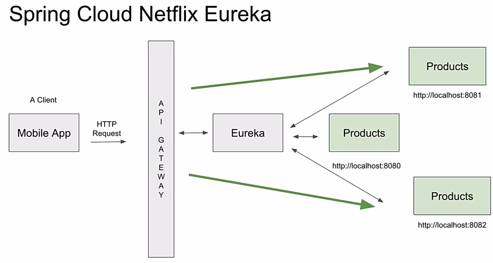

# Gateway and Eureka Discover Service

---



## Eureka Discovery Service (Spring cloud Netflix Eureka)

It makes microservices find each others.

### To Create Main Container:

- First create new project (main container), and choose the java with maven.
  Then remove src folder.
- Beacause the default packaging in the root pom.xml is jar then we need to change it into:

```xml
<packaging>pom</packaging>
```

### Create Discovery Service

- Inside the main container choose new Module...
- Then inside dependencies choose Eureka server
- Add **@EnableEurekaServer** anotation into main spring boot app
- inside application.properties:

```
spring.application.name=DiscoveryServer
server.port=8761
eureka.client.register-with-eureka=false
eureka.client.fetch-registry=false
eureka.instance.prefer-ip-address=true
#eureka.instance.hostname=localhost
eureka.client.service-url.defaultZone=http://localhost:8761/eureka
```

### Create Product Service

- Inside main container choose new Module...
- Dependencies: Web, Lombok, Eureka Client
