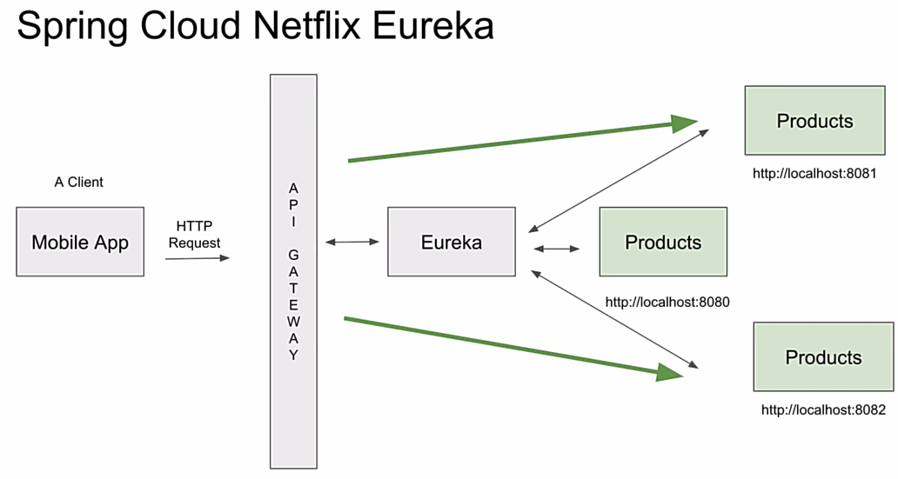
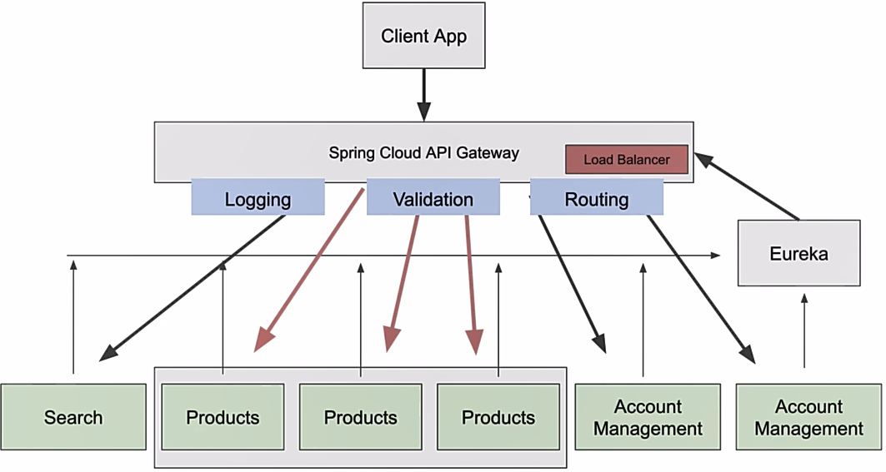

# Gateway and Eureka Discover Service



## Eureka Discovery Service (Spring cloud Netflix Eureka)

It makes microservices find each others.

### To Create Main Container:

- First create new project (main container), and choose the java with maven.
  Then remove src folder.
- Beacause the default packaging in the root pom.xml is jar then we need to change it into:

```xml
<packaging>pom</packaging>
```

- After adding the other modules then we should add them in the main pom:

```xml
<modules>
    <module>discovery-server</module>
    <module>product-service</module>
    <module>api-gateway</module>
</modules>
```

### Create Discovery Service

- Inside the main container choose new Module...
- Then inside dependencies choose Eureka server
- Add **@EnableEurekaServer** anotation into main spring boot app

```java
@EnableEurekaServer
@SpringBootApplication
public class DiscoveryServerApplication {
```

- inside application.properties:

```
spring.application.name=discovery-server
server.port=8761
eureka.client.register-with-eureka=false
eureka.client.fetch-registry=false
eureka.instance.prefer-ip-address=true
eureka.instance.hostname=localhost
eureka.client.service-url.defaultZone=http://192.168.1.11:8761/eureka
```

### Create Product Application

- Inside main container choose new Module...
- Dependencies: Web, Lombok, Eureka Client, postgresql
- Add **@EnableDiscoveryClient** anotation into main application

```java
@EnableDiscoveryClient
@SpringBootApplication
public class ProductServiceApplication {
```

- Inside application.properties

```
server.port=0
spring.application.name=product-service
eureka.client.service-url.defaultZone=http://localhost:8761/eureka
eureka.instance.instance-id=${spring.application.name}:${instanceId:${random.value}}
#don't forget to add this:
eureka.instance.prefer-ip-address=true
```

- Postgresql settings:

```
spring.jpa.properties.hibernate.dialect = org.hibernate.dialect.PostgreSQLDialect

spring.jpa.hibernate.ddl-auto=create-drop
spring.jpa.show-sql=true

spring.datasource.url=${SPRING_DATASOURCE_URL:jdbc:postgresql://localhost:5432/axonservice1}
spring.datasource.username=${SPRING_DATASOURCE_USERNAME:postgres}
spring.datasource.password=${SPRING_DATABASE_PASSWORD:12345}
```

by setting **eureka.instance.instance-id** we can run more service, for example 3 product serivce

```java
@Autowired
private Environment env;
...
String s= env.getProperty("local.server.port");
//server.port == 0 but local.server.port is the real port
```

### API Gateway



- Inside main app crate new module (api-gateway)
- Dependencies: Api Gateway, webflux (for api gateway), Eureka Client

```xml
spring-boot-starter-webflux
spring-cloud-gateway-server-webflux
spring-cloud-starter-netflix-eureka-client
(spring-cloud-starter-gateway is going to be deprecated)
```

- Inside application.properties:

```
spring.application.name=api-gateway
server.port=8082
eureka.client.service-url.defaultZone=http://localhost:8761/eureka
eureka.client.register-with-eureka=true
eureka.client.fetch-registry=true

spring.cloud.gateway.server.webflux.discovery.locator.enabled=true
spring.cloud.gateway.server.webflux.discovery.locator.lower-case-service-id=true

logging.level.org.springframework.cloud.gateway=DEBUG
```

- Inside api-gateway app add **@EnableDiscoveryClient**

```java
@EnableDiscoveryClient
@SpringBootApplication
public class ApiGatewayApplication {
```
