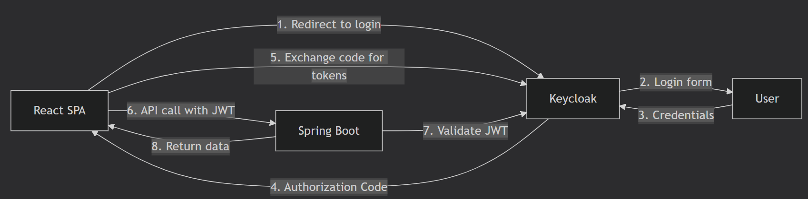
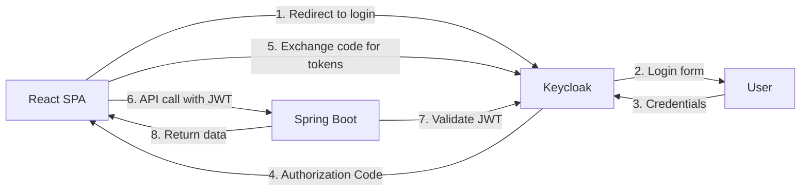

## Keycloak

[back](../README.md)

[ReactJS (keycloak-js)](./keycloak-js.md)

Integrating Keycloak with a React and Spring Boot application is a great way to add robust security without building everything from scratch. The recommended approach uses the **OAuth 2.0 Authorization Code Flow with PKCE**, which is designed specifically for Single-Page Applications (SPAs) like yours .

Here is the step-by-step flow of how a user authenticates and your frontend securely communicates with your backend.


### 🔑 Breaking Down the Authentication Flow

The diagram shows a high-level interaction. Let's break down each critical step for your `React + Spring Boot` stack.

1.  **The Login Redirect**: When a user visits your React app, the Keycloak client (`keycloak-js`) checks for an existing login. If none is found, it redirects the browser to Keycloak's login page .
2.  **The Authorization Code**: After the user successfully logs in, Keycloak doesn't send the token directly. Instead, it sends a temporary `authorization_code` back to the React app's redirect URI .
3.  **Exchanging Code for Tokens**: React takes this code and, using the PKCE verifier generated earlier, securely exchanges it with Keycloak for a set of tokens: an `access_token`, a `refresh_token`, and an `id_token` .
4.  **Storing and Using the Token**: Your React app now holds the `access_token`. For any subsequent API call to your Spring Boot backend, it must include this token in the HTTP `Authorization` header as a `Bearer` token .

```javascript
// Example of how your React app sends the token to the backend
fetch("http://localhost:8080/api/products", {
  headers: {
    Authorization: `Bearer ${keycloak.token}`,
  },
});
```

5.  **Validating the Token in Spring Boot**: Your Spring Boot backend, configured as an OAuth2 Resource Server, does not need to call Keycloak for every request. Instead, it validates the incoming JWT's signature using the public key it fetches from Keycloak. It also checks claims like `exp` (expiration) and `aud` (audience) to ensure the token is valid and intended for this service .
6.  **Refreshing the Token**: Access tokens are short-lived (e.g., 5 minutes). Your React app uses the `refresh_token` to get a new `access_token` from Keycloak without bothering the user to log in again. This is usually done silently in the background before an API call .

### 🛠️ The Developer's Setup Guide

To implement this flow, you'll need to configure each part of your application.

#### **1. Configure Keycloak (Admin Console)**

First, you need to register your frontend application as a client in Keycloak .

- **Client ID**: `react-app` (or a name of your choice)
- **Client Type**: `Public` (SPAs cannot keep a secret safely)
- **Valid Redirect URIs**: `http://localhost:3000/*` (This is critical. After login, Keycloak will only redirect to URLs in this list.)
- **Standard Flow Enabled**: `ON` (This enables the Authorization Code Flow)
- **PKCE Enabled**: `ON` with `S256` as the code challenge method.

#### **2. React Frontend Integration**

The easiest way to integrate is using the `keycloak-js` library .

**First, install the library:**

```bash
npm install keycloak-js
```

**Then, initialize it in your app's entry point (e.g., `src/index.js`):**

```javascript
import Keycloak from "keycloak-js";

const keycloak = new Keycloak({
  url: "http://localhost:8080",
  realm: "your-realm-name",
  clientId: "react-app",
});

keycloak
  .init({ onLoad: "login-required", pkceMethod: "S256" })
  .then((authenticated) => {
    if (authenticated) {
      // Render your React app after successful login
      ReactDOM.render(<App />, document.getElementById("root"));
    }
  });
```

After this, `keycloak.token` will contain the access token you need to send to your backend.

#### **3. Spring Boot Backend (Resource Server)**

Your backend needs to be configured to accept and validate the JWT. Spring Boot makes this very simple with the `spring-boot-starter-oauth2-resource-server` .

**Add the dependency** to your `pom.xml`:

```xml
<dependency>
    <groupId>org.springframework.boot</groupId>
    <artifactId>spring-boot-starter-oauth2-resource-server</artifactId>
</dependency>
```

**Configure your `application.yml` or `application.properties`** to tell Spring where to find Keycloak's configuration (it will automatically fetch the public keys):

```yaml
spring:
  security:
    oauth2:
      resourceserver:
        jwt:
          issuer-uri: http://localhost:8080/realms/your-realm-name
```

**Create a Security Configuration Class** to define which endpoints are protected:

```java
@Configuration
@EnableWebSecurity
public class SecurityConfig {

    @Bean
    public SecurityFilterChain filterChain(HttpSecurity http) throws Exception {
        http
            .cors().and().csrf().disable() // Disable CSRF for stateless APIs
            .authorizeHttpRequests(authz -> authz
                .requestMatchers("/api/public/**").permitAll()
                .requestMatchers("/api/admin/**").hasRole("ADMIN")
                .anyRequest().authenticated()
            )
            .oauth2ResourceServer(oauth2 -> oauth2.jwt());
        return http.build();
    }
}
```

### 💡 Pro-Tips & Key Takeaways

- **Use PKCE, Always**: For a React SPA, a "public" client with the Authorization Code Flow + PKCE is the modern, secure standard. It replaces the older implicit flow .
- **Stateless is Good**: Your Spring Boot backend validates the JWT _locally_ using the signature. This means it doesn't need to call Keycloak on every request, making your API fast and scalable .
- **Handle Token Expiration Gracefully**: Use `keycloak.updateToken(30)` in your React app before API calls. This attempts to refresh the token if it will expire in the next 30 seconds, creating a seamless user experience .
- **Role-Based Access Control (RBAC)**: You can define roles for users in Keycloak. These roles will be included as claims inside the JWT. Your Spring Security configuration can then use `.hasRole("ADMIN")` to authorize requests based on those roles .

This architecture is a robust, industry-standard way to secure modern web applications. If you'd like to see a fully working example, check out some of the excellent demo projects on GitHub .

---

Here is a comprehensive explanation of configuring Keycloak for JWT-based, stateless APIs in a Spring Boot application.

The core of this setup involves configuring your Spring Boot application as an OAuth2 **Resource Server**. This tells Spring Security to expect a JWT (the token from Keycloak) in the `Authorization` header of incoming API requests, to validate it, and to extract user information from it without creating a server-side session.

### 🛠️ Step-by-Step Implementation Guide

Here is how to set up your Spring Boot application step-by-step.

#### 1. Add Dependencies

First, you need the OAuth2 Resource Server dependency in your `pom.xml` or `build.gradle` file.

```xml
<dependency>
    <groupId>org.springframework.boot</groupId>
    <artifactId>spring-boot-starter-oauth2-resource-server</artifactId>
</dependency>
```

This starter includes Spring Security and all the necessary components to process JWTs.

#### 2. Configure `application.yml`

Next, configure your `application.yml` to point to your Keycloak realm. Spring Boot will use this URI to automatically discover the necessary endpoints (like the JWK Set URI for verifying token signatures).

```yaml
spring:
  security:
    oauth2:
      resourceserver:
        jwt:
          issuer-uri: http://localhost:8080/realms/your-realm-name
```

**Important:** Replace the URL and realm name with your actual Keycloak values.

#### 3. Create the Security Configuration Class

This is the most important part. You'll create a configuration class to define your security rules. The key points are to disable sessions and enable the resource server.

```java
@Configuration
@EnableWebSecurity
@EnableMethodSecurity(prePostEnabled = true) // Enables @PreAuthorize annotations
public class SecurityConfig {

    @Bean
    public SecurityFilterChain filterChain(HttpSecurity http) throws Exception {
        http
            .csrf(csrf -> csrf.disable()) // 1. Disable CSRF for stateless APIs
            .sessionManagement(session -> session.sessionCreationPolicy(SessionCreationPolicy.STATELESS)) // 2. Make it stateless
            .authorizeHttpRequests(authz -> authz
                .requestMatchers("/api/public/**").permitAll() // 3. Public endpoints
                .anyRequest().authenticated() // 4. All other requests need authentication
            )
            .oauth2ResourceServer(oauth2 -> oauth2
                .jwt(jwt -> jwt.jwtAuthenticationConverter(jwtAuthenticationConverter())) // 5. JWT configuration and custom converter
            );
        return http.build();
    }

    // Bean to map Keycloak roles to Spring Security authorities
    @Bean
    public JwtAuthenticationConverter jwtAuthenticationConverter() {
        JwtGrantedAuthoritiesConverter grantedAuthoritiesConverter = new JwtGrantedAuthoritiesConverter();
        grantedAuthoritiesConverter.setAuthorityPrefix("ROLE_");
        // Configure how roles are extracted from the JWT claims
        grantedAuthoritiesConverter.setAuthoritiesClaimName("realm_access.roles");

        JwtAuthenticationConverter jwtAuthenticationConverter = new JwtAuthenticationConverter();
        jwtAuthenticationConverter.setJwtGrantedAuthoritiesConverter(grantedAuthoritiesConverter);
        return jwtAuthenticationConverter;
    }
}
```

- **Key Points of the Configuration:**
  - `SessionCreationPolicy.STATELESS`: This is crucial. It ensures Spring never creates an `HttpSession`, which is the foundation for a stateless API.
  - `csrf().disable()`: CSRF (Cross-Site Request Forgery) protection is based on sessions. Since you have no sessions, CSRF protection is not needed and can be disabled.
  - **Custom `JwtAuthenticationConverter`**: Keycloak stores roles in its own specific claim format (e.g., inside a `realm_access` map). The `JwtAuthenticationConverter` is where you tell Spring Security how to read these claims and translate them into `GrantedAuthority` objects (like `ROLE_USER` or `ROLE_ADMIN`) that it understands for authorization decisions.

#### 4. Secure Your Endpoints with Annotations

With the configuration in place, you can secure your REST controllers using `@PreAuthorize` annotations, which is a very clean and declarative way to manage access control.

```java
@RestController
@RequestMapping("/api")
public class ApiController {

    @GetMapping("/public/hello")
    public String publicHello() {
        return "This is a public endpoint.";
    }

    @GetMapping("/user/profile")
    @PreAuthorize("hasRole('ROLE_user')")
    public String userProfile() {
        return "This is a protected user profile.";
    }

    @GetMapping("/admin/dashboard")
    @PreAuthorize("hasRole('ROLE_admin')")
    public String adminDashboard() {
        return "This is a protected admin dashboard.";
    }
}
```

In this example, only a request containing a JWT with the role `user` can access `/user/profile`. The exact role name (`user`) will depend on how you have configured your roles in Keycloak.

### ❓ Key Considerations & Common Pitfalls

When implementing this pattern, keep the following points in mind to avoid common mistakes.

- **Role Mapping is Critical**: Extracting roles from Keycloak's token is a common point of failure. Keycloak's default structure is a JSON object. You must configure the `jwtAuthenticationConverter` to parse it correctly; otherwise, Spring Security will not see any roles, and all `@PreAuthorize` checks will fail.
- **Distinct Roles for `@PreAuthorize`**: By convention, Spring Security checks for roles using `hasRole('ROLE_NAME')`. The `GrantedAuthoritiesConverter` adds the `ROLE_` prefix by default, so you should use `hasRole('ROLE_NAME')` or `hasAuthority('ROLE_ROLE_NAME')` in your annotations.
- **Don't Mix `oauth2Login` and `oauth2ResourceServer` on the Same Filter Chain**: A common confusion is mixing login and resource server configurations.
  - **`oauth2Login`** is used for applications that need to redirect users to Keycloak's login page. It is **stateful** (uses sessions).
  - **`oauth2ResourceServer`** is for APIs that receive a JWT token. It is **stateless**.
    If your API needs to handle browser logins and API tokens, you must define two separate `SecurityFilterChain` beans, one for each purpose.

### 📊 Summary of Key Properties

| Configuration Aspect | Purpose                                            | Setting                                                  |
| :------------------- | :------------------------------------------------- | :------------------------------------------------------- |
| **Statelessness**    | Disables HTTP sessions                             | `sessionCreationPolicy(SessionCreationPolicy.STATELESS)` |
| **CSRF**             | Disables session-based protection                  | `csrf().disable()`                                       |
| **Authorization**    | Configures public vs. private endpoints            | `authorizeHttpRequests()`                                |
| **Token Validation** | Configures Spring as a Resource Server             | `oauth2ResourceServer().jwt()`                           |
| **Role Mapping**     | Maps Keycloak roles to Spring Security authorities | `jwtAuthenticationConverter()`                           |

If you provide more details about your Keycloak realm setup (like your specific role structure), I can offer more targeted guidance on the configuration.

---

This is a critical architectural decision when building React + Spring Boot applications with Keycloak. You have **two main approaches**, and understanding them will save you many headaches.

## 🎯 The Two Main Approaches

### **Approach 1: Backend as Pure Resource Server (Recommended for most SPAs)**

In this approach, your Spring Boot backend is **only** a resource server. It never handles login directly. Instead, Keycloak handles all authentication directly with the React frontend.





#### How to implement:

**React Frontend - Using Keycloak JS Adapter:**

```javascript
// Install: npm install keycloak-js
import Keycloak from "keycloak-js";

const keycloakConfig = {
  url: "http://localhost:8080",
  realm: "your-realm",
  clientId: "your-react-client",
};

const keycloak = new Keycloak(keycloakConfig);

// Initialize Keycloak
keycloak
  .init({
    onLoad: "login-required", // or 'check-sso'
    pkceMethod: "S256", // Important for SPAs!
  })
  .then((authenticated) => {
    if (authenticated) {
      console.log("User is authenticated");
      // Store token and start making API calls
      localStorage.setItem("token", keycloak.token);

      // Setup auto-refresh
      setInterval(() => {
        keycloak.updateToken(70).then((refreshed) => {
          if (refreshed) {
            localStorage.setItem("token", keycloak.token);
          }
        });
      }, 60000);
    }
  });

// Function to make authenticated API calls
async function callApi() {
  const response = await fetch("http://localhost:8080/api/user/profile", {
    headers: {
      Authorization: `Bearer ${keycloak.token}`,
    },
  });
  return response.json();
}
```

**Spring Boot Backend Configuration (Resource Server only):**

```java
@Configuration
@EnableWebSecurity
@EnableMethodSecurity(prePostEnabled = true)
public class ResourceServerConfig {

    @Bean
    public SecurityFilterChain filterChain(HttpSecurity http) throws Exception {
        http
            .csrf(csrf -> csrf.disable())
            .sessionManagement(session -> session.sessionCreationPolicy(SessionCreationPolicy.STATELESS))
            .authorizeHttpRequests(authz -> authz
                .requestMatchers("/api/public/**").permitAll()
                .anyRequest().authenticated()
            )
            .oauth2ResourceServer(oauth2 -> oauth2
                .jwt(jwt -> jwt.jwtAuthenticationConverter(jwtAuthenticationConverter()))
            );
        return http.build();
    }

    @Bean
    public JwtAuthenticationConverter jwtAuthenticationConverter() {
        JwtGrantedAuthoritiesConverter converter = new JwtGrantedAuthoritiesConverter();
        converter.setAuthorityPrefix("ROLE_");
        converter.setAuthoritiesClaimName("realm_access.roles");

        JwtAuthenticationConverter jwtConverter = new JwtAuthenticationConverter();
        jwtConverter.setJwtGrantedAuthoritiesConverter(converter);
        return jwtConverter;
    }
}
```

**Keycloak Client Configuration:**

- Create a client with **Access Type: `public`** (for SPA)
- Enable **Standard Flow** (Authorization Code)
- Enable **PKCE** (Proof Key for Code Exchange) - Required for SPAs
- Set **Valid Redirect URIs**: `http://localhost:3000/*`
- Set **Valid Post Logout Redirect URIs**: `http://localhost:3000`

**Pros of this approach:**

- ✅ True stateless backend - no session management needed
- ✅ React handles authentication flow natively
- ✅ Better user experience (no full page reloads)
- ✅ Keycloak handles token refresh automatically
- ✅ Lower backend complexity

**Cons:**

- ❌ Token handling logic in frontend (security considerations with localStorage)
- ❌ Need to manage token refresh manually or via library

---

### **Approach 2: Backend as OAuth2 Client + Resource Server Combined**

If you absolutely need the backend to handle login (e.g., for server-side rendering or legacy reasons), you create **two separate security configurations**.

```java
@Configuration
public class MultiSecurityConfig {

    // Configuration for API endpoints (stateless, JWT only)
    @Bean
    @Order(1)
    public SecurityFilterChain apiFilterChain(HttpSecurity http) throws Exception {
        http
            .securityMatcher("/api/**") // Only apply to API paths
            .csrf(csrf -> csrf.disable())
            .sessionManagement(session -> session.sessionCreationPolicy(SessionCreationPolicy.STATELESS))
            .authorizeHttpRequests(authz -> authz
                .anyRequest().authenticated()
            )
            .oauth2ResourceServer(oauth2 -> oauth2.jwt());
        return http.build();
    }

    // Configuration for web pages (stateful, handles login)
    @Bean
    @Order(2)
    public SecurityFilterChain webFilterChain(HttpSecurity http) throws Exception {
        http
            .securityMatcher("/**") // All other paths
            .oauth2Login(oauth2 -> oauth2
                .loginPage("/oauth2/authorization/keycloak")
                .defaultSuccessUrl("/home")
            )
            .oauth2Client(Customizer.withDefaults())
            .authorizeHttpRequests(authz -> authz
                .requestMatchers("/public/**", "/login").permitAll()
                .anyRequest().authenticated()
            );
        return http.build();
    }
}
```

**Then in your `application.yml`:**

```yaml
spring:
  security:
    oauth2:
      client:
        registration:
          keycloak:
            client-id: your-confidential-client
            client-secret: your-client-secret
            authorization-grant-type: authorization_code
            scope: openid,profile,email
        provider:
          keycloak:
            issuer-uri: http://localhost:8080/realms/your-realm
      resourceserver:
        jwt:
          issuer-uri: http://localhost:8080/realms/your-realm
```

**For React with this approach** (not recommended):

- React would need to redirect to backend endpoints (`/oauth2/authorization/keycloak`)
- Backend handles the OAuth2 flow and creates an HTTP session
- React would need to manage cookies (session) instead of JWTs
- This is **stateful** and defeats the purpose of stateless APIs

---

## ✅ **My Recommendation for Your React + Spring Boot Architecture**

Use **Approach 1** with the React application handling authentication directly with Keycloak. Here's why:

```javascript
// Example: React component with Keycloak
function App() {
  const [keycloak, setKeycloak] = useState(null);
  const [authenticated, setAuthenticated] = useState(false);

  useEffect(() => {
    const initKeycloak = async () => {
      const kc = new Keycloak("/keycloak.json");

      try {
        const auth = await kc.init({
          onLoad: "check-sso",
          pkceMethod: "S256",
        });

        if (auth) {
          setAuthenticated(true);
          setKeycloak(kc);

          // Setup token refresh
          kc.onTokenExpired = () => {
            kc.updateToken(30).then((refreshed) => {
              if (refreshed) {
                console.log("Token refreshed");
              }
            });
          };
        }
      } catch (error) {
        console.error("Keycloak init error", error);
      }
    };

    initKeycloak();
  }, []);

  // Axios interceptor to add token to all requests
  useEffect(() => {
    if (keycloak) {
      axios.interceptors.request.use((config) => {
        config.headers.Authorization = `Bearer ${keycloak.token}`;
        return config;
      });
    }
  }, [keycloak]);

  const handleLogin = () => {
    keycloak.login();
  };

  const handleLogout = () => {
    keycloak.logout();
  };

  return (
    <div>
      {authenticated ? (
        <>
          <button onClick={handleLogout}>Logout</button>
          <Dashboard />
        </>
      ) : (
        <button onClick={handleLogin}>Login</button>
      )}
    </div>
  );
}
```

## 📋 Summary

| Aspect                  | Approach 1 (Pure Resource Server)      | Approach 2 (OAuth2 Client + Resource Server) |
| ----------------------- | -------------------------------------- | -------------------------------------------- |
| **Session Management**  | Stateless                              | Stateful (for web pages)                     |
| **Where login happens** | React → Keycloak directly              | React → Backend → Keycloak                   |
| **Token storage**       | Frontend (localStorage/sessionStorage) | Backend (session) + cookies                  |
| **Best for**            | Modern SPAs, mobile apps               | Traditional server-rendered apps             |
| **Complexity**          | Lower after setup                      | Higher (managing two contexts)               |
| **Scalability**         | Excellent                              | Limited by session replication               |

**Bottom line**: Don't try to make your backend handle login for a React SPA. Keep it as a pure resource server (stateless) and let Keycloak's JavaScript adapter handle authentication directly with your React app. This gives you true stateless APIs and a much cleaner architecture.
