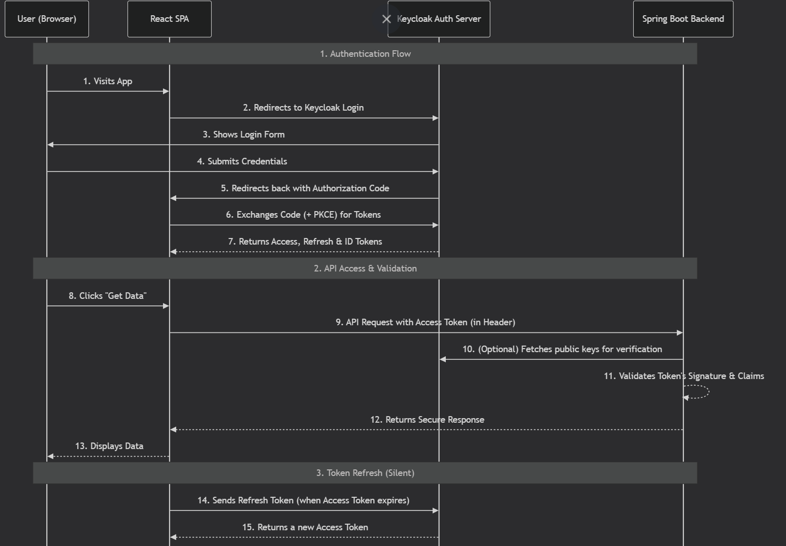
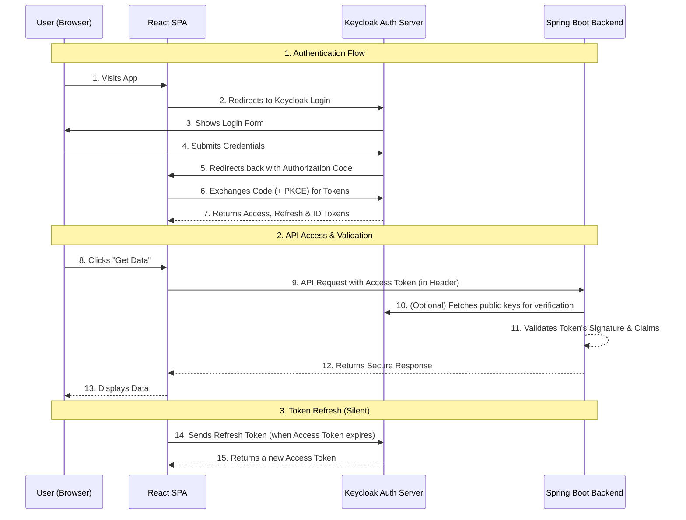

## Keycloak

[back](../README.md)

Integrating Keycloak with a React and Spring Boot application is a great way to add robust security without building everything from scratch. The recommended approach uses the **OAuth 2.0 Authorization Code Flow with PKCE**, which is designed specifically for Single-Page Applications (SPAs) like yours .

Here is the step-by-step flow of how a user authenticates and your frontend securely communicates with your backend.





### 🔑 Breaking Down the Authentication Flow

The diagram shows a high-level interaction. Let's break down each critical step for your `React + Spring Boot` stack.

1.  **The Login Redirect**: When a user visits your React app, the Keycloak client (`keycloak-js`) checks for an existing login. If none is found, it redirects the browser to Keycloak's login page .
2.  **The Authorization Code**: After the user successfully logs in, Keycloak doesn't send the token directly. Instead, it sends a temporary `authorization_code` back to the React app's redirect URI .
3.  **Exchanging Code for Tokens**: React takes this code and, using the PKCE verifier generated earlier, securely exchanges it with Keycloak for a set of tokens: an `access_token`, a `refresh_token`, and an `id_token` .
4.  **Storing and Using the Token**: Your React app now holds the `access_token`. For any subsequent API call to your Spring Boot backend, it must include this token in the HTTP `Authorization` header as a `Bearer` token .

```javascript
// Example of how your React app sends the token to the backend
fetch("http://localhost:8080/api/products", {
  headers: {
    Authorization: `Bearer ${keycloak.token}`,
  },
});
```

5.  **Validating the Token in Spring Boot**: Your Spring Boot backend, configured as an OAuth2 Resource Server, does not need to call Keycloak for every request. Instead, it validates the incoming JWT's signature using the public key it fetches from Keycloak. It also checks claims like `exp` (expiration) and `aud` (audience) to ensure the token is valid and intended for this service .
6.  **Refreshing the Token**: Access tokens are short-lived (e.g., 5 minutes). Your React app uses the `refresh_token` to get a new `access_token` from Keycloak without bothering the user to log in again. This is usually done silently in the background before an API call .

### 🛠️ The Developer's Setup Guide

To implement this flow, you'll need to configure each part of your application.

#### **1. Configure Keycloak (Admin Console)**

First, you need to register your frontend application as a client in Keycloak .

- **Client ID**: `react-app` (or a name of your choice)
- **Client Type**: `Public` (SPAs cannot keep a secret safely)
- **Valid Redirect URIs**: `http://localhost:3000/*` (This is critical. After login, Keycloak will only redirect to URLs in this list.)
- **Standard Flow Enabled**: `ON` (This enables the Authorization Code Flow)
- **PKCE Enabled**: `ON` with `S256` as the code challenge method.

#### **2. React Frontend Integration**

The easiest way to integrate is using the `keycloak-js` library .

**First, install the library:**

```bash
npm install keycloak-js
```

**Then, initialize it in your app's entry point (e.g., `src/index.js`):**

```javascript
import Keycloak from "keycloak-js";

const keycloak = new Keycloak({
  url: "http://localhost:8080",
  realm: "your-realm-name",
  clientId: "react-app",
});

keycloak
  .init({ onLoad: "login-required", pkceMethod: "S256" })
  .then((authenticated) => {
    if (authenticated) {
      // Render your React app after successful login
      ReactDOM.render(<App />, document.getElementById("root"));
    }
  });
```

After this, `keycloak.token` will contain the access token you need to send to your backend.

#### **3. Spring Boot Backend (Resource Server)**

Your backend needs to be configured to accept and validate the JWT. Spring Boot makes this very simple with the `spring-boot-starter-oauth2-resource-server` .

**Add the dependency** to your `pom.xml`:

```xml
<dependency>
    <groupId>org.springframework.boot</groupId>
    <artifactId>spring-boot-starter-oauth2-resource-server</artifactId>
</dependency>
```

**Configure your `application.yml` or `application.properties`** to tell Spring where to find Keycloak's configuration (it will automatically fetch the public keys):

```yaml
spring:
  security:
    oauth2:
      resourceserver:
        jwt:
          issuer-uri: http://localhost:8080/realms/your-realm-name
```

**Create a Security Configuration Class** to define which endpoints are protected:

```java
@Configuration
@EnableWebSecurity
public class SecurityConfig {

    @Bean
    public SecurityFilterChain filterChain(HttpSecurity http) throws Exception {
        http
            .cors().and().csrf().disable() // Disable CSRF for stateless APIs
            .authorizeHttpRequests(authz -> authz
                .requestMatchers("/api/public/**").permitAll()
                .requestMatchers("/api/admin/**").hasRole("ADMIN")
                .anyRequest().authenticated()
            )
            .oauth2ResourceServer(oauth2 -> oauth2.jwt());
        return http.build();
    }
}
```

### 💡 Pro-Tips & Key Takeaways

- **Use PKCE, Always**: For a React SPA, a "public" client with the Authorization Code Flow + PKCE is the modern, secure standard. It replaces the older implicit flow .
- **Stateless is Good**: Your Spring Boot backend validates the JWT _locally_ using the signature. This means it doesn't need to call Keycloak on every request, making your API fast and scalable .
- **Handle Token Expiration Gracefully**: Use `keycloak.updateToken(30)` in your React app before API calls. This attempts to refresh the token if it will expire in the next 30 seconds, creating a seamless user experience .
- **Role-Based Access Control (RBAC)**: You can define roles for users in Keycloak. These roles will be included as claims inside the JWT. Your Spring Security configuration can then use `.hasRole("ADMIN")` to authorize requests based on those roles .

This architecture is a robust, industry-standard way to secure modern web applications. If you'd like to see a fully working example, check out some of the excellent demo projects on GitHub .
