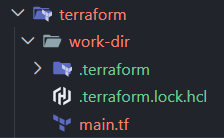
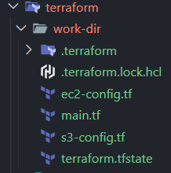

## Terrafrom

[back](../README.md)

[AWS](../aws/README.md)

### Terraform workflow

init → plan → apply → destroy

```bash
terraform init
terraform plan
terraform apply

terraform destroy
```

or

```bash
# pip install terraform-local

tflocal init
tflocal plan
tflocal apply

tflocal destroy
```

## init terraform

```bash
# filename: main.tf

provider "aws" {
  region     = "us-east-1"
  access_key = "test"
  secret_key = "test"


  endpoints {
    # Storage
    s3 = "http://s3.localhost.localstack.cloud:4566"

    # Compute
    ec2 = "http://localhost:4566"

    # Databases
    dynamodb = "http://localhost:4566"
    rds = "http://localhost:4566"

    # Application Integration
    lambda = "http://localhost:4566"
    sqs = "http://localhost:4566"
    sns = "http://localhost:4566"
    sts  = "http://localhost:4566"

    # Management
    cloudwatch = "http://localhost:4566"
    iam = "http://localhost:4566"

    # API Gateway
    apigateway = "http://localhost:4566"
  }

  skip_credentials_validation = true
  skip_metadata_api_check     = true
  skip_requesting_account_id  = true
}
```

- terraform init

```bash
# terraform init

# Initializing the backend...

# Initializing provider plugins...
# - Finding latest version of hashicorp/aws...
# - Installing hashicorp/aws v6.59.0...
# - Installed hashicorp/aws v6.59.0 (signed by HashiCorp)

# Terraform has created a lock file .terraform.lock.hcl to record the provider
# selections it made above. Include this file in your version control repository
# so that Terraform can guarantee to make the same selections by default when
# you run "terraform init" in the future.

# Terraform has been successfully initialized!

# You may now begin working with Terraform. Try running "terraform plan" to see
# any changes that are required for your infrastructure. All Terraform commands
# should now work.

# If you ever set or change modules or backend configuration for Terraform,
# rerun this command to reinitialize your working directory. If you forget, other
# commands will detect it and remind you to do so if necessary.
```



## apply terraform

```bash
# ec2-config.tf

# --- Networking (Required for EC2) ---
# A VPC to hold the instance [citation:8]
resource "aws_vpc" "my_vpc" {
  cidr_block = "10.0.0.0/16"
  tags = { Name = "local-vpc" }
}

# A subnet within the VPC [citation:8]
resource "aws_subnet" "public_subnet" {
  vpc_id                  = aws_vpc.my_vpc.id
  cidr_block              = "10.0.1.0/24"
  map_public_ip_on_launch = true # Important for assigning a public IP for SSH/HTTP
  tags = { Name = "local-subnet" }
}

# A Security Group to define network traffic rules [citation:1]
resource "aws_security_group" "web_sg" {
  name        = "allow-web-ssh"
  description = "Allow SSH and HTTP traffic"
  vpc_id      = aws_vpc.my_vpc.id

  # Allow SSH for debugging
  ingress {
    description = "SSH from anywhere"
    from_port   = 22
    to_port     = 22
    protocol    = "tcp"
    cidr_blocks = ["0.0.0.0/0"]
  }

  # Allow HTTP for web traffic
  ingress {
    description = "HTTP from anywhere"
    from_port   = 80
    to_port     = 80
    protocol    = "tcp"
    cidr_blocks = ["0.0.0.0/0"]
  }

  egress {
    from_port   = 0
    to_port     = 0
    protocol    = "-1"
    cidr_blocks = ["0.0.0.0/0"]
  }
}

# --- EC2 Instance ---
# The main EC2 resource
resource "aws_instance" "web_server" {
  # LocalStack accepts any AMI ID; this is a standard placeholder [citation:3]
  ami           = "ami-12345678"
  instance_type = "t3.nano" # Or "t2.micro", but be aware of potential issues with burstable types [citation:10]

  # Attach the instance to your networking components
  subnet_id                   = aws_subnet.public_subnet.id
  vpc_security_group_ids      = [aws_security_group.web_sg.id]
  associate_public_ip_address = true

  # User data script to install and run nginx on startup
  user_data = <<-EOF
    #!/bin/bash
    apt-get update -y
    apt-get install -y nginx
    systemctl start nginx
  EOF

  tags = {
    Name = "Local-Nginx-Server"
  }
}
```

then run `terraform apply`



```bash
$ terraform state list
# aws_instance.web_server
# aws_security_group.web_sg
# aws_subnet.public_subnet
# aws_vpc.my_vpc
```

## Add s3 bucket

```bash
resource "aws_s3_bucket" "test-bucket" {
  bucket = "my-test-bucket-123"
}
```

plan → apply

```bash
terraform plan
terraform apply
```

```bash
$ aws s3 ls --endpoint-url=http://localhost:4566
```

```bash
$ terraform state list
# aws_s3_bucket.test-bucket
```

```bash
$ terraform state show aws_s3_bucket.test-bucket

# resource "aws_s3_bucket" "test-bucket" {
#     acceleration_status         = null
#     arn                         = "arn:aws:s3:::my-test-bucket-123"
#     bucket                      = "my-test-bucket-123"
#     bucket_domain_name          = "my-test-bucket-123.s3.amazonaws.com"
#     bucket_namespace            = "global"
#     bucket_prefix               = null
#     bucket_region               = "us-east-1"
#     bucket_regional_domain_name = "my-test-bucket-123.s3.us-east-1.amazonaws.com"
#     force_destroy               = false
#     hosted_zone_id              = "Z3AQBSTGFYJSTF"
#     id                          = "my-test-bucket-123"
#     object_lock_enabled         = false
#     policy                      = null
#     region                      = "us-east-1"
#     request_payer               = "BucketOwner"
#     tags_all                    = {}

#     grant {
#         id          = "75aa57f09aa0c8caeab4f8c24e99d10f8e7faeebf76c078efc7c6caea54ba06a"
#         permissions = [
#             "FULL_CONTROL",
#         ]
#         type        = "CanonicalUser"
#         uri         = null
#     }

#     server_side_encryption_configuration {
#         rule {
#             bucket_key_enabled = false

#             apply_server_side_encryption_by_default {
#                 kms_master_key_id = null
#                 sse_algorithm     = "AES256"
#             }
#         }
#     }

#     versioning {
#         enabled    = false
#         mfa_delete = false
#     }
# }
```
